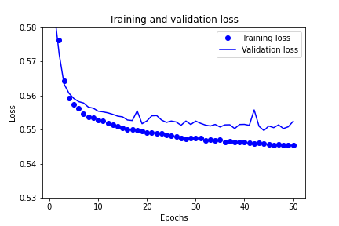
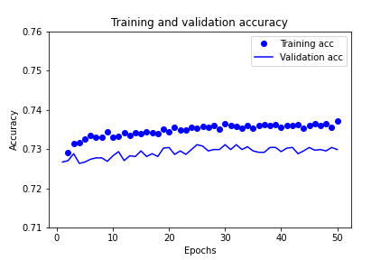
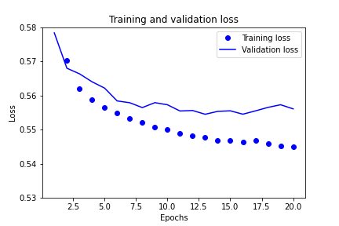
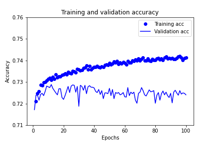

# Neural_Network_Charity_Analysis

## Optimization 1

I start optimizing the model using chapters 4 and 5 from "Deep Learning in Python" (F. Cholett). I follow the recommendations from Module 19  in Optimization 2.

### Training, VALIDATION, and test data

#### Not to use test data at all

Before I looked into the book, I optimized my model to do better on test data. But thar meant I was biasing it towards my data. Now I don't use tes data at all, only for the final test. I split data 2/1 and split that 1/3 to 1/6 (validation data) and 1/6 (test data).

### Training and validation loss and accuracy dynamics

#### Is there any difference?

Loss|Accuracy
---|---
|

Even training accuracy is lower than 75%, and validation accuracy is even worse.

On the other hand, although accuracy is volatile, I don't see any min/maxes, so I change the epochs' number to 50 for this NN. Maybe I should increase it later, when I modify my NN.

Loss|Accuracy
---|---
|

Now the the lines are much closer to each other, it may mean the NN overfits less.

### Experimenting with learning rate

#### Is learning rate optimal?

Adam's default learning rate is 0.001, and it seems to be optimal for now.

Learning rate|Loss|Accuracy
---|---|---
0.01||
0.001||
0.0001||

## Optimization 2

### bin ASK_AMT

I binned ASK_AMT to `bins = [0, 5001, 3e4, 6e5, 3e6, np.inf]`

It looks like this:

Frequency|Density
---|---
|

The result is:

Loss|Accuracy
---|---
|

Now I binned ASK_AMT to `bins = [0, 5001, 3e6, np.inf]`

Frequency|Density
---|---
|

The result is:

Loss|Accuracy
---|---
|

### layers and nodes

I doubled the number of hidden nodes.

`hidden_nodes_layer1 = 16`
`hidden_nodes_layer2 = 10`

Loss|Accuracy
---|---
|

I added a hidden layer similar to the first one.

`hidden_nodes_layer1 = 8`
`hidden_nodes_layer2 = 8`
`hidden_nodes_layer3 = 5`

Loss|Accuracy
---|---
|

All my layers used `relu` activation function except the last one (`sigmoid`). Now I changed af for the second layer to `softmax`

`hidden_nodes_layer1 = 8`, `relu`

`hidden_nodes_layer2 = 8`, `softmax`

`hidden_nodes_layer3 = 5`, `relu`

Output layer, `sigmoid`

Loss|Accuracy
---|---
|

I changed activation functions this way:

`hidden_nodes_layer1 = 8`, `relu`

`hidden_nodes_layer2 = 8`, `relu`

`hidden_nodes_layer3 = 5`, `softmax`

Output layer, `sigmoid`

Loss|Accuracy
---|---
|

I doubled all layers:

`hidden_nodes_layer1 = 16`, `relu`

`hidden_nodes_layer2 = 16`, `relu`

`hidden_nodes_layer3 = 10`, `softmax`

Output layer, `sigmoid`

Loss|Accuracy
---|---
|

I reduced epoch number from 50 to 20. I didn't change the layers.

`20 epochs`

`hidden_nodes_layer1 = 16`, `relu`

`hidden_nodes_layer2 = 16`, `relu`

`hidden_nodes_layer3 = 10`, `softmax`

Output layer, `sigmoid`

Loss|Accuracy
---|---
|

I doubled all layers:

`20 epochs`

`hidden_nodes_layer1 = 32`, `relu`

`hidden_nodes_layer2 = 32`, `relu`

`hidden_nodes_layer3 = 20`, `softmax`

Output layer, `sigmoid`

Loss|Accuracy
---|---
|

I reduced all layers back and changed activation functions:

`20 epochs`

`hidden_nodes_layer1 = 16`, `sigmoid`

`hidden_nodes_layer2 = 16`, `relu`

`hidden_nodes_layer3 = 10`, `softmax`

Output layer, `sigmoid`

Loss|Accuracy
---|---
|

I changed activation functions:

`20 epochs`

`hidden_nodes_layer1 = 16`, `relu`

`hidden_nodes_layer2 = 16`, `sigmoid`

`hidden_nodes_layer3 = 10`, `softmax`

Output layer, `sigmoid`

Loss|Accuracy
---|---
|

I changed activation functions:

`20 epochs`

`hidden_nodes_layer1 = 16`, `relu`

`hidden_nodes_layer2 = 16`, `softmax`

`hidden_nodes_layer3 = 10`, `softmax`

Output layer, `sigmoid`

Loss|Accuracy
---|---
|

I doubled all layers:

`20 epochs`

`hidden_nodes_layer1 = 32`, `relu`

`hidden_nodes_layer2 = 32`, `softmax`

`hidden_nodes_layer3 = 20`, `softmax`

Output layer, `sigmoid`

Loss|Accuracy
---|---
|

I reduced all layers back and changed the activation function for the 3rd hidden layer to `sigmoid`:

`20 epochs`

`hidden_nodes_layer1 = 16`, `relu`

`hidden_nodes_layer2 = 16`, `softmax`

`hidden_nodes_layer3 = 10`, `sigmoid`

Output layer, `sigmoid`

Loss|Accuracy
---|---
|

I doubled all layers:

`20 epochs`

`hidden_nodes_layer1 = 32`, `relu`

`hidden_nodes_layer2 = 32`, `softmax`

`hidden_nodes_layer3 = 20`, `sigmoid`

Output layer, `sigmoid`

Loss|Accuracy
---|---
|

I reduced all layers back and changed the activation function for the 3rd hidden layer to `tanh`:

`20 epochs`

`hidden_nodes_layer1 = 16`, `relu`

`hidden_nodes_layer2 = 16`, `softmax`

`hidden_nodes_layer3 = 10`, `tanh`

Output layer, `sigmoid`

Loss|Accuracy
---|---
|

I changed activation functions:

`20 epochs`

`hidden_nodes_layer1 = 16`, `relu`

`hidden_nodes_layer2 = 16`, `tanh`

`hidden_nodes_layer3 = 10`, `softmax`

Output layer, `sigmoid`

Loss|Accuracy
---|---
|

I changed activation functions:

`20 epochs`

`hidden_nodes_layer1 = 16`, `sigmoid`

`hidden_nodes_layer2 = 16`, `relu`

`hidden_nodes_layer3 = 10`, `softmax`

Output layer, `sigmoid`

Loss|Accuracy
---|---
|

I changed activation functions:

`20 epochs`

`hidden_nodes_layer1 = 16`, `tanh`

`hidden_nodes_layer2 = 16`, `relu`

`hidden_nodes_layer3 = 10`, `softmax`

Output layer, `sigmoid`

Loss|Accuracy
---|---
|

I doubled the layers:

`20 epochs`

`hidden_nodes_layer1 = 32`, `tanh`

`hidden_nodes_layer2 = 32`, `relu`

`hidden_nodes_layer3 = 20`, `softmax`

Output layer, `sigmoid`

Loss|Accuracy
---|---
|

I changed layers' size like this (all hidden layers are equal):

`20 epochs`

`hidden_nodes_layer1 = 16`, `tanh`

`hidden_nodes_layer2 = 16`, `relu`

`hidden_nodes_layer3 = 16`, `softmax`

Output layer, `sigmoid`

Loss|Accuracy
---|---
|

I changed 1st hidden layer's af to `relu`:

`20 epochs`

`hidden_nodes_layer1 = 16`, `relu`

`hidden_nodes_layer2 = 16`, `relu`

`hidden_nodes_layer3 = 16`, `softmax`

Output layer, `sigmoid`

Loss|Accuracy
---|---
|

I doubled the layers.

`20 epochs`

`hidden_nodes_layer1 = 32`, `relu`

`hidden_nodes_layer2 = 32`, `relu`

`hidden_nodes_layer3 = 32`, `softmax`

Output layer, `sigmoid`

Loss|Accuracy
---|---
|

first to `sigmoid`

`20 epochs`

`hidden_nodes_layer1 = 32`, `sigmoid`

`hidden_nodes_layer2 = 32`, `relu`

`hidden_nodes_layer3 = 32`, `softmax`

Output layer, `sigmoid`

Loss|Accuracy
---|---
|

3rd to `relu`

`20 epochs`

`hidden_nodes_layer1 = 32`, `sigmoid`

`hidden_nodes_layer2 = 32`, `relu`

`hidden_nodes_layer3 = 32`, `relu`

Output layer, `sigmoid`

Loss|Accuracy
---|---
|

Increased epoch num to 30

`30 epochs`

`hidden_nodes_layer1 = 32`, `sigmoid`

`hidden_nodes_layer2 = 32`, `relu`

`hidden_nodes_layer3 = 32`, `relu`

Output layer, `sigmoid`

Loss|Accuracy
---|---
|

Reduced epoch num back to 20 and changed 1st to `softmax`

`30 epochs`

`hidden_nodes_layer1 = 32`, `softmax`

`hidden_nodes_layer2 = 32`, `relu`

`hidden_nodes_layer3 = 32`, `relu`

Output layer, `sigmoid`

Loss|Accuracy
---|---
|

I binned CLASSIFICATION 200, 1800, 1800+. Layewrs are:

`50 epochs`

`hidden_nodes_layer1 = 32`, `sigmoid`

`hidden_nodes_layer2 = 32`, `relu`

`hidden_nodes_layer3 = 32`, `relu`

Output layer, `sigmoid`

Loss|Accuracy
---|---
|

I deleted ASK_AMT

`50 epochs`

`hidden_nodes_layer1 = 32`, `sigmoid`

`hidden_nodes_layer2 = 32`, `relu`

`hidden_nodes_layer3 = 32`, `relu`

Output layer, `sigmoid`

Loss|Accuracy
---|---
|

ASK_AMT and INCOME_AMT are deleted.

`50 epochs`

`hidden_nodes_layer1 = 32`, `sigmoid`

`hidden_nodes_layer2 = 32`, `relu`

`hidden_nodes_layer3 = 32`, `relu`

Output layer, `sigmoid`

Loss|Accuracy
---|---
|

## Optimization 3

ASK_AMT and INCOME_AMT are back, STATUS and SPECIAL_CONSIDERATIONS are deleted.

`100 epochs`

`hidden_nodes_layer1 = 128`, `sigmoid`

`hidden_nodes_layer2 = 128`, `tanh`

`hidden_nodes_layer3 = 128`, `sigmoid`

Output layer, `sigmoid`

Loss|Accuracy
---|---
|

STATUS and SPECIAL_CONSIDERATIONS are deleted.

The layers are back to the very beginning.

`50 epochs`

`hidden_nodes_layer1 = 8`, `relu`

`hidden_nodes_layer2 = 5`, `relu`

Output layer, `sigmoid`

Loss|Accuracy
---|---
|

STATUS and SPECIAL_CONSIDERATIONS are deleted.

The layers are:

`50 epochs`

`hidden_nodes_layer1 = 8`, `relu`

`hidden_nodes_layer2 = 8`, `relu`

`hidden_nodes_layer2 = 5`, `relu`

Output layer, `sigmoid`

Loss|Accuracy
---|---
|

STATUS and SPECIAL_CONSIDERATIONS are deleted.

The layers are:

`50 epochs`

`hidden_nodes_layer1 = 16`, `sigmoid`

`hidden_nodes_layer2 = 16`, `relu`

`hidden_nodes_layer2 = 10`, `relu`

Output layer, `sigmoid`

Loss|Accuracy
---|---
|

STATUS and SPECIAL_CONSIDERATIONS are deleted.

The layers are of the same size now:

`50 epochs`

`hidden_nodes_layer1 = 16`, `sigmoid`

`hidden_nodes_layer2 = 16`, `relu`

`hidden_nodes_layer2 = 16`, `relu`

Output layer, `sigmoid`

Loss|Accuracy
---|---
|

STATUS and SPECIAL_CONSIDERATIONS are deleted.

The layers are doubled (in size):

`50 epochs`

`hidden_nodes_layer1 = 32`, `sigmoid`

`hidden_nodes_layer2 = 32`, `relu`

`hidden_nodes_layer2 = 32`, `relu`

Output layer, `sigmoid`

Loss|Accuracy
---|---
|

STATUS and SPECIAL_CONSIDERATIONS are deleted.

`50 epochs`

`hidden_nodes_layer1 = 32`, `relu`

`hidden_nodes_layer2 = 32`, `relu`

`hidden_nodes_layer2 = 32`, `relu`

Output layer, `sigmoid`

Loss|Accuracy
---|---
|

STATUS and SPECIAL_CONSIDERATIONS are deleted.

`50 epochs`

`hidden_nodes_layer1 = 32`, `relu`

`hidden_nodes_layer2 = 32`, `sigmoid`

`hidden_nodes_layer2 = 32`, `relu`

Output layer, `sigmoid`

Loss|Accuracy
---|---
|

STATUS and SPECIAL_CONSIDERATIONS are deleted.

`50 epochs`

`hidden_nodes_layer1 = 32`, `sigmoid`

`hidden_nodes_layer2 = 32`, `sigmoid`

`hidden_nodes_layer2 = 32`, `relu`

Output layer, `sigmoid`

Loss|Accuracy
---|---
|

STATUS and SPECIAL_CONSIDERATIONS are deleted.

`50 epochs`

`hidden_nodes_layer1 = 128`, `sigmoid`

`hidden_nodes_layer2 = 128`, `softmax`

`hidden_nodes_layer2 = 128`, `relu`

Output layer, `sigmoid`

Loss|Accuracy
---|---
|

I forgot to include ASK_AMT_BINS for several iterations earlier. I am not sure when it started. From now on it is in the model.

STATUS and SPECIAL_CONSIDERATIONS are deleted.

`50 epochs`

`hidden_nodes_layer1 = 64`, `selu`

`hidden_nodes_layer2 = 64`, `sigmoid`

`hidden_nodes_layer2 = 64`, `selu`

Output layer, `sigmoid`

Loss|Accuracy
---|---
|

STATUS and SPECIAL_CONSIDERATIONS are deleted.

`50 epochs`

`hidden_nodes_layer1 = 64`, `selu`

`hidden_nodes_layer2 = 32`, `sigmoid`

`hidden_nodes_layer2 = 16`, `selu`

Output layer, `sigmoid`

Loss|Accuracy
---|---
|
