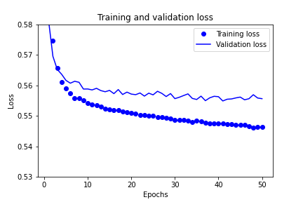

# Neural_Network_Charity_Analysis

## Optimization 1

I start optimizing the model using chapters 4 and 5 from "Deep Learning in Python" (F. Cholett). I follow the recommendations from Module 19  in Optimization 2.

### Training, VALIDATION, and test data

#### Not to use test data at all

Before I looked into the book, I optimized my model to do better on test data. But thar meant I was biasing it towards my data. Now I don't use tes data at all, only for the final test. I split data 2/1 and split that 1/3 to 1/6 (validation data) and 1/6 (test data).

### Training and validation loss and accuracy dynamics

#### Is there any difference?

Loss|Accuracy
---|---
|

Even training accuracy is lower than 75%, and validation accuracy is even worse.

On the other hand, although accuracy is volatile, I don't see any min/maxes, so I change the epochs' number to 50 for this NN. Maybe I should increase it later, when I modify my NN.

Loss|Accuracy
---|---
|

Now the the lines are much closer to each other, it may mean the NN overfits less.

### Experimenting with learning rate

#### Is learning rate optimal?

Adam's default learning rate is 0.001, and it seems to be optimal for now.

Learning rate|Loss|Accuracy
---|---|---
0.01||
0.001||
0.0001||

## Optimization 2

### bin ASK_AMT

I binned ASK_AMT to `bins = [0, 5001, 3e4, 6e5, 3e6, np.inf]`

The result is:

Loss|Accuracy
---|---
|

